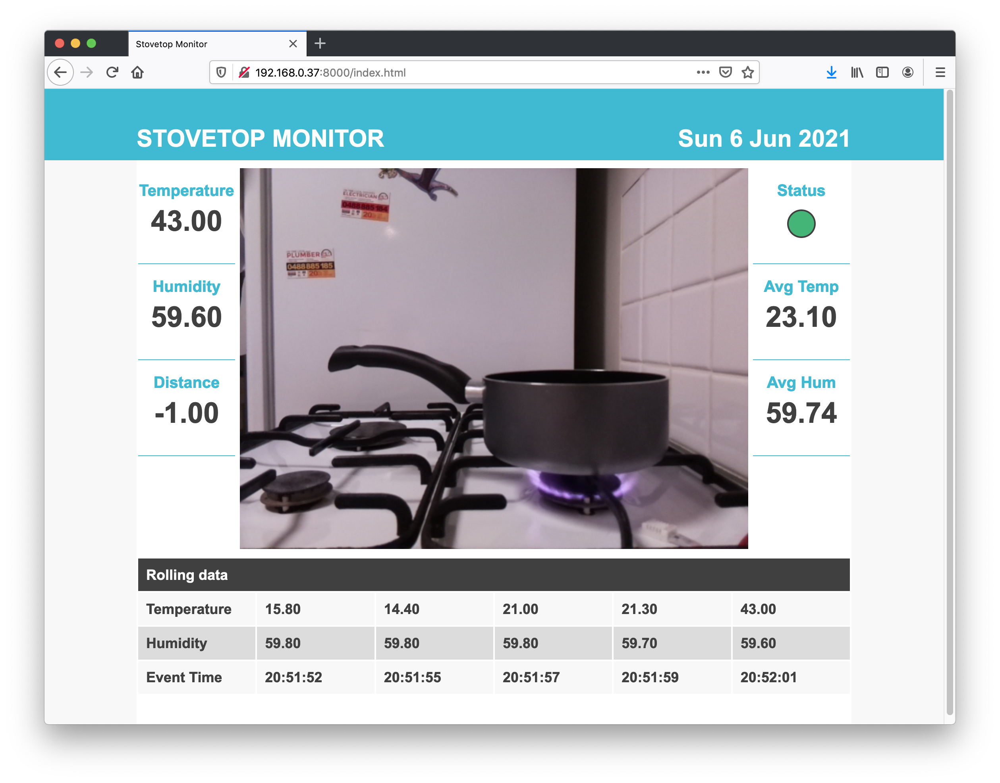

# SIT210 Project - Stovetop Monitor

# Overview
The Stovetop Monitor project is a collection of embedded systems to monitor a gas stovetop and provide alert if stovetop temperature is detected to be over a set time frame.

The system makes use of Google Cloud Platform PubSub topics integrated into the Particle environment.



## Components
Hardware
* Particle Argon
* DHT22 Temperature/Humidity sensor
* HC-SR04 Ultrasonic range/distance sensor
* Raspberry Pi
* PiCamera
* Green and Red LEDs
* Buzzer

Software - This repository contains source code for
* Particle Argon `.ino` file and `.properties`
* Python and html code for Raspberry Pi

Additional services
* Particle Console Integration environment
* Google Cloud Platform - PubSub

## Run application
Particle
1. Log into Particle Console
2. Create Google Cloud Platform integration using Google Project Id and Pubsub topic name
3. Upload Particle code into Particle online IDE
4. Flash to Particle device

Google Cloud Platform (GCP)
1. Log into GCP and create project, topic and topic subscription - check this link for more info https://cloud.google.com/pubsub/docs/quickstart-console
2. Create service account with permissions to subscribe to the topic
3. Download service account credentials file - this should be in JSON format

Raspberry Pi
1. Clone this repo onto Raspberry Pi
2. Copy GCP service account credentials file to Raspberry Pi
3. Create and activate python virtual environment - use `requirements.txt` for dependencies
4. Export GCP project id, topic subcription and credentials into environment variables
```
export GOOGLE_APPLICATION_CREDENTIALS="/path/to/credential/my-project-1234.json"
export GCP_PROJECT_ID="my-project"
export GCP_TOPIC_SUB_ID="my-topic-sub"
```
5. Change directory and run application
```
cd stovetop_monitor
python main.py
```
6. Open dashboard in browser at `127.0.0.1:8000` 


## Tests
To run tests from root directory
```
python -m unittest test.stove_metrics_test
```